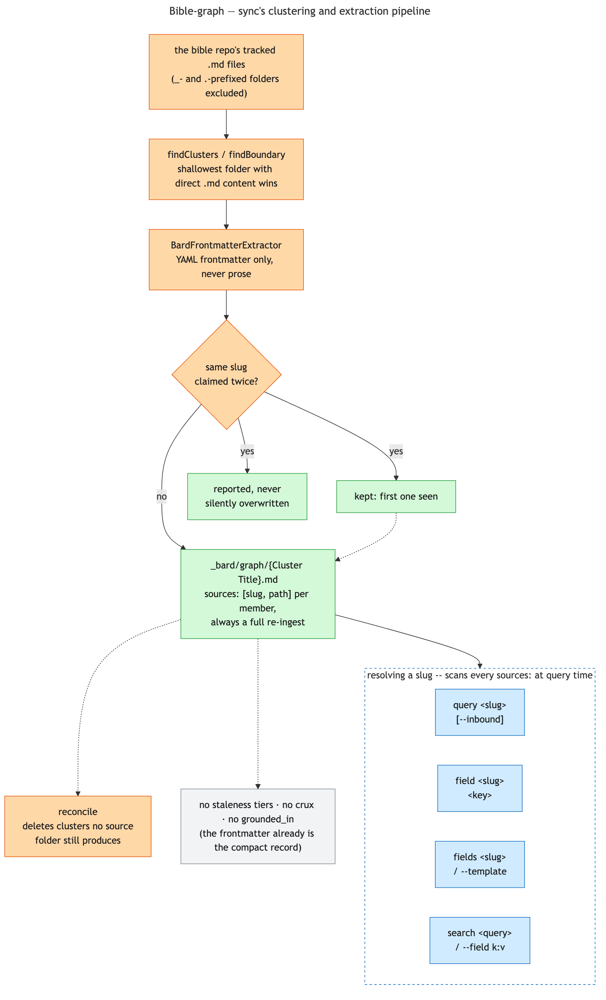

# Bible-graph: the structured half

A YAML-templated fiction book bible (character/place/faction/item entries) needs the same thing a
code repo does — a small, precise map instead of re-reading the whole corpus every session — but
none of the reasons [Synapse Graph](../synapse/synapse-graph.md) is as mechanically elaborate as it is apply
here. There's no orientation-then-clustering LLM pass, because a bible's own folder taxonomy
already is the cluster hierarchy. There's no crux, no grounded summary, no staleness tiers, because
YAML frontmatter already is the compact record — there's nothing to compress. `sync` is a
mechanical transform with zero judgment calls, not `/synapse-init`'s mechanism.



## `synapse-bard sync`: always a full re-ingest

Walks the bible repo's tracked `.md` files (any `_`- or `.`-prefixed folder excluded — `_templates/`,
`_planning/`, `_system/`), clusters them, extracts each one's YAML frontmatter, and writes one
`_bard/graph/{Cluster Title}.md` per cluster. Never incremental: the whole corpus extracts in
~10ms, so there's nothing dirty-tracking would buy that re-ingesting everything doesn't already
give for free.

### Clustering needs no LLM pass at all

Synapse's own code graph needs `/synapse-init`'s vocabulary/directory-weight orientation because
"where does meaning live in this tree" has no language-neutral answer. A bible repo doesn't have
that problem — its author already organizes it by folder (`characters/main/`, `world/magic/`), and
that taxonomy **is** the cluster boundary, mechanically discoverable with no interpretation step.

The exact rule, settled by measurement against a real 65-file bible (see
`findClusters`/`findBoundary` in `src/apps/bard/sync_cmd.zig`): from each top-level, non-excluded
folder, walk down until you hit the **shallowest** directory that directly contains a `.md` file.
That directory is the cluster boundary — every `.md` at or below it, however deep, belongs to this
one cluster, and no further boundary is drawn beneath it even if a subdirectory has its own direct
content too. `characters/antagonists/Severen/`'s three-level-deep case needs no special handling
under this rule: `characters/antagonists/` itself has a direct `.md` (a minor antagonist with no
subfolder of their own), so *that* becomes the boundary, and `Severen/`/`Aidan Dayne/` are absorbed
into the same cluster rather than getting their own.

Measured against the real repo this shipped for: 65 files → 24 clusters, 63% fewer nodes than the
one-file-per-entity layout `sync` originally wrote. Fourteen of those 24 are singletons — mostly
the main POV characters, each alone in its own leaf folder next to only an `images/` subfolder,
with no shallower shared ancestor to absorb it into. That's the real shape of the tree, not a
flaw in the rule, and arguably the right outcome for a bible's six most important entities anyway.

### Extraction: frontmatter only, refuse rather than guess

`BardFrontmatterExtractor` (`src/adapters/bard/frontmatter.zig`) parses only the YAML frontmatter
block, never the markdown prose body — deliberate, so nothing here duplicates content a future
prose-summary layer might one day own. It's a real YAML subset, not a bespoke ad-hoc parser:
scalars, block lists (bare-scalar or list-of-objects), flow lists, arbitrary nested-map depth, and
`[[wikilink]]` values anywhere — including more than one per scalar string, which real data needs
(`current_holder: "[[gael-varis|Gael Varis]] (active), [[calla-starweaver|Calla Starweaver]]
(issued, never used)"` has two in one string).

What it refuses, rather than silently skipping: anchors, aliases, block scalars, flow maps, tab
indentation, and a flow list holding anything other than scalars/wikilinks — the whole file, not
just the offending field. A parser that skips unknowns becomes a bad general YAML parser by
accretion, silently dropping relationships from notes that otherwise look fine; a visible, reported
refusal is recoverable, a silently missing ref is not.

A bare `---` line in the prose body (a Markdown scene-break/horizontal rule) is *not* refused as a
second document — the prose body is never parsed, so it's inert there, and real notes use `---` to
mark scene breaks throughout.

**def/ref shape:** a `def` is the file's own identity — `name:` at the root, `kind` from the
root-level `template:` field (an entity's own declared schema, e.g. `character_pov`, `place`,
`faction`). A `ref` is every `[[wikilink]]` found by *recursively* scanning every scalar and list
value in the frontmatter tree, `kind` set to the dotted field path it came from
(`relationships.key_relationships.link`, `foreign_relations.enemies`) — never inferred about what
the *target* is; that's the caller's job, read from the target file's own `template:` field, not
guessed from the field name that pointed at it. A `carried_items` entry and a `key_relationships`
entry can both point at something that turns out to be a place, not a character — the source field
name carries no authority over that.

## `sources:`: the seam between a cluster and its real files

A cluster node's body is generated content, not a copy of any entity's frontmatter — its own
frontmatter carries a `sources:` list, one entry per member: `slug` (the wikilink target, the
member's filename stem) and `path` (its real repo-relative source file). The body is just an
`## Entities` heading with a wikilinked bullet per member; a human can hand-write real prose below
the `<!-- synapse:generated:end -->` marker and it survives every future `sync` untouched, same
fencing convention Synapse's own `## Notes` uses.

**Every read resolves *through* `sources:`, never by reading a cluster node directly as if it held
the entity's own data.** `query`/`field`/`fields`/`search` all take a slug, scan every cluster's
`sources:` for a match, then read and extract the *real* file that path names. There's no
reverse-index file doing this lookup — measured, not assumed: on the real corpus's shape (24
clusters, 64 entities), a full scan costs ~180µs average, a reverse index a flat ~20µs. The gap
is real in relative terms (9–17×) but the absolute cost is noise against a CLI invocation's own
process-launch and `git rev-parse` cost, already low single-digit milliseconds before any cluster
file is even opened. One less generated artifact to keep in sync, for a saving that isn't
perceptible at this scale.

**Slug collisions are global, not per-cluster.** A slug can only resolve to one real path — `query`
needs exactly one answer — so two entities anywhere in the corpus sharing a filename stem is a
collision even if they land in different clusters. `sync` reports it and keeps whichever it saw
first; it never silently overwrites one entity's data with another's.

**Reconciliation removes what source no longer produces.** After writing every cluster that still
has at least one accepted member, `sync` deletes every existing `_bard/graph/` node *not* in that
set — a renamed folder, an emptied one, or one where every member's frontmatter now refuses to
parse leaves no stale cluster node behind for `--inbound`/`search` to keep surfacing.

## Drift detection: `--check` and the `SessionStart` hook

Nothing runs `sync` automatically, so `_bard/graph/` can fall behind the moment someone edits an
entity's YAML by hand between sessions. [Synapse Graph](../synapse/synapse-graph.md)'s own
two-tier staleness model would be the obvious thing to port, but it solves a cost problem `sync`
doesn't have — Tier 1 flags and Tier 2 lazily regenerates specifically to avoid re-running
*expensive, LLM-authored* prose generation, and `sync` has neither: it's a ~10ms mechanical
extract-and-cluster pass, already a full re-ingest every time it runs. Porting the two-tier
machinery would add a digest field, a per-node `stale:` flag, and a lazy regeneration path to
protect a regeneration cost that simply isn't real here.

**`synapse-bard sync --check`** answers the cheaper, actually-relevant question instead: would a
real `sync` change anything? It runs the exact same clustering/extraction pipeline
(`adapters.bard_sync_plan.computePlan` — the one implementation both the write path and `--check`
share, so there's never a second, parallel notion of what `sync` would produce) and compares each
computed cluster's generated region — never the whole file, so a hand-added tail below the
`<!-- synapse:generated:end -->` fence never counts — against what's on disk right now. No new
state is stored anywhere to make this work: the comparison baseline is `_bard/graph/`'s own
already-git-tracked content, so there's nothing that can itself drift out of sync the way a stored
baseline commit could after a rebase. Exit 0 when nothing's out of date, exit 1 with a per-cluster
report otherwise — same convention this repo's own doc generators (`generate-diagrams.sh --check`)
already use.

**`synapse-bard-hook`'s `SessionStart` handler calls the same check in-process** (never by shelling
out to the `synapse-bard` binary) and, only when it finds real drift, injects one line — a count
and a pointer to run `sync` — alongside the vault-index/standing-instructions pieces it already
injects. It only ever reports. It never writes `_bard/graph/` itself, on the same "flag, don't
silently fix" principle Synapse's own Tier 1 hook follows, minus everything Tier 1 needed to make
that safe for expensive regeneration — there's no expensive regeneration here to defer in the
first place, just a cheap check and a decision to surface rather than hide. An unconditional
every-session `sync` and a stored last-synced-commit marker were both considered and rejected —
the former because it writes to the working tree before anyone's done anything, the latter because
it would be a second, redundant copy of a fact `_bard/graph/`'s own content already records.

## Querying the graph

```
synapse-bard query <slug> [--inbound]        resolved relationships, outbound by default
synapse-bard field <slug> <key>               one raw frontmatter value, verbatim
synapse-bard fields <slug>                    a template's own field names
synapse-bard fields --template <name>         same, by template name directly, no example needed
synapse-bard search <query>                   full-text over every entity's frontmatter
synapse-bard search --field <key>:<value>     exact match on a root-level field, e.g. faction
```

**`query`** resolves a slug through `sources:`, extracts that one real file, and prints its defs
(the entity itself) and refs (its resolved outbound wikilinks) — `Gael Varis (character_pov)` then
one indented line per outbound relationship, kind and target. `--inbound` flips the direction: it
has to resolve the *whole* graph rather than one slug, since a backlink needs every other entity's
outbound refs scanned for a match, then filters out a self-reference the same way the vault side
does.

**`field`** is the plain fallback for anything `query` can't see — `query` only ever surfaces
`[[wikilink]]`-bearing fields, since that's the whole extraction contract, so an ordinary field like
`images` or `appearance.voice` is otherwise invisible to the CLI entirely. Root-level keys only, no
dotted nested paths.

**`fields`** answers "what's worth asking `field` for" before guessing key by key — read a
template's own field list once (`_templates/{name}_template.md`'s own frontmatter keys) rather than
probing four clean misses before hitting the right one. This shipped after exactly that happened in
a real writing-assistant simulation: `query`'s own output named an entity's template
(`Gael Varis (character_pov)`), but nothing said what fields that template actually has.

**`search`** is always full-text over frontmatter, never treated as `key:value` even with a colon
in it — the `--field` flag is what disambiguates, so unlike `BardGraphStore`'s own single-string
port method (used only for the vault side's simpler shape), there's no colon-ambiguity heuristic to
get wrong. It reads every entity's real source file through its cluster's `sources:`, same as
`query`/`field`, and searches only the frontmatter block — never the prose body, holding to the
same boundary every other piece of this system does.

## What this deliberately doesn't have

Synapse's full code-node lifecycle — LLM-authored crux and summary, `sources_digest`-based
staleness, `grounded_in` hash-verified evidence — exists to compress a large, opaque source file
into something that doesn't need re-reading and re-deriving every session. Structured YAML
frontmatter doesn't have that problem: the frontmatter already *is* the compact record. A
consequence worth naming: because a bard graph node carries no LLM-authored prose to preserve
across drift, there's no `/synapse-rebuild-diff`/`/synapse-rebuild-full` triage split either —
re-running `sync` is just idempotent regeneration, not a triage problem.

This stays deliberately deferred rather than ruled out forever: it would earn its place if a bulkier
prose section (world-lore essays, planning documents) ever needed scoped summarization, but nothing
in the corpus this shipped against crossed that line — checked directly rather than assumed:
~118,600 words across *every* markdown file in the repo, nowhere close to where a flat
`grep`/`Grep` becomes the bottleneck.

Prose-body `[[wikilinks]]` inside entity files stay out of the graph entirely too, on purpose, not
by oversight — a fresh corpus grep found entity files with real prose-body relationships that never
made it into structured frontmatter at all. Surfacing that gap as a diagnostic was considered and
declined: the frontmatter-only extraction boundary exists specifically to keep prose from becoming
a second source of graph-structural authority by degrees, and formalizing an informal prose
relationship is the author's own canon-audit call, not something a tool should nudge into
happening.
