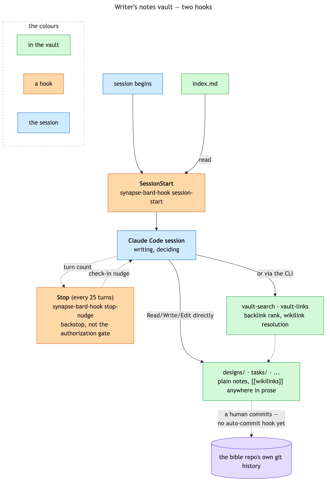

# Writer's notes vault: repo-local, from the start

While an author and a writing agent iterate on a scene, they make decisions that have nothing to do
with [the Bible-graph](bard-graph.md)'s structured facts — tone choices, deferred plot resolutions,
phrasing preferences, "we're not resolving X until book 2" — but are exactly the kind of context a
session shouldn't have to silently re-derive or lose. `_bard/vault/` is where that free-form,
decision-level layer lives: plain markdown files, git-tracked, in the same repo and session already
in use for everything else.



## Why repo-local, and not a hosted vault on another machine

`_bard/vault/`'s primary execution environment is the Android app's default cloud session: an
Anthropic-managed VM with no network route to anything on the author's own machine. A
remotely-hosted vault is exactly the one thing that execution mode can never reach, so
`_bard/vault/` stays entirely inside the bible repo itself.

`_bard/vault/` is a second `Store` implementation of the same port `_bard/graph/` uses
(`ports.Store` — `read`/`write`/`list`/`search`), backed by a plain directory instead of any
remote transport. No external service, no network dependency in any execution environment the
repo gets cloned into — the same property [Bible-graph](bard-graph.md) has. Opening `_bard/vault/`
in Obsidian on a desktop remains available purely as a human browsing convenience; the agent's own
reads and writes never depend on it being open, or existing at all.

## Folder layout

Notes live in subdirectories, unlike the graph's flat `_bard/graph/{Cluster}.md` layout — a
five-folder taxonomy mapped onto fiction writing (`projects/` → per-book/scene iteration logs,
`research/` → worldbuilding research, `designs/` → story/plot design discussions,
`scratchpad/`/`inbox/` self-explanatory), but nothing beyond `designs/`/`tasks/` is pre-created —
the writing agent grows the rest organically through actual use. `Index.md` at the vault root is
the one file excluded from every listing and search — bootstrap, not a note.

## Two hooks: `SessionStart` and a periodic `Stop` check-in

Both gated on `_bard/` already existing at the repo root — nothing here creates it, so its absence
means bard has never been deliberately used in this repo. A repo with no fiction bible at all, the
plugin merely installed, gets no injection at all.

Once `_bard/` exists, `synapse-bard-hook session-start` injects two pieces, joined with a blank
line, nothing emitted at all if both are empty: the plugin's own standing instructions
(`synapse-bard-claude.md`) and `_bard/vault/Index.md` itself, so its folder layout is live
information from turn one. `synapse-bard sync` seeds `Index.md` from the shipped template
automatically the first time it runs in a repo, so this normally already exists; the rare case
where it doesn't (a repo synced before that existed, or `_bard/graph/` created some other way) is
what this hook's fallback message covers.

`synapse-bard-hook stop-nudge` fires on `Stop`, every 25 turns, and re-raises the same question:
did anything since the last check-in belong in the vault? This is a backstop for a session that
runs long and drifts, not the trigger that authorizes writing in the first place — the standing
instruction to write proactively lives in `synapse-bard-claude.md` and applies on its own
initiative regardless of whether a hook is even wired up, since the Android app's default cloud
session has no `Stop` hook at all.

Deliberately simple otherwise: `_bard/vault/` is always repo-relative, so there's no external
config file to resolve, no cross-repo namespace to catalogue, no remote to verify before a write.
There's also no per-prompt injection — and the one gap worth naming plainly: **no auto-commit
hook**. `_bard/vault/` is git-tracked the same as any other part of the repo, but nothing commits
it automatically. An uncommitted mistake here is only as recoverable as the session's own file
history or a human's deliberate `git commit`; a committed one is one `git show <sha>:<path>` away,
same as any other tracked file. If a destructive edit is about to happen and nothing's been
committed recently, that's worth saying before proceeding, not after.

## `vault-search` / `vault-links`: resolving wikilinks the way Obsidian does

Both close the same gap: `Grep` can string-match `[[note-name` but can't tell a real link from a
coincidental substring, doesn't resolve an aliased `[[note-name|display text]]` link at all, and has
no notion of *rank* or *direction*. `BardVaultStore` resolves links the same way Obsidian itself
does — by the **target's filename stem**, `.md` suffix optional, alias text after a `|` ignored —
and both commands are thin CLI doors onto that resolution:

```
synapse-bard vault-search <query>    full-text over _bard/vault/, ranked by backlink count
synapse-bard vault-links <note>      every note that links to <note>
```

**`vault-search`** is an exhaustive substring scan — no embeddings, no maintained index, refreshed
cheaply on every read rather than kept warm by a daemon, since a book bible's whole vault is well
inside grep-speed territory. What makes it more than `Grep` is the ranking: hits sort by how many
*other* notes link to the matching note (most-linked first, node path ascending as a deterministic
tiebreak), the same "in-edge coupling" idea the
[Graft project](https://github.com/NanoNets/Graft)'s own ranking uses for a code graph, applied here
to a wikilink graph instead of a call graph. A note with zero backlinks that still matches the query
is still returned — backlink count is a rank, not a filter.

**`vault-links`** answers "which notes link *here*" directly, the vault-side equivalent of the
graph's own `query --inbound`. It takes either a full vault-relative path or just a bare stem — both
`"designs/synapse-bard/Bible-graph.md"` and `"Bible-graph"` resolve to the same note, the same
flexibility a `[[wikilink]]` target itself has. Returns `null` (reported as "no note by this name")
for a target that resolves to nothing at all, distinct from a real, empty answer for a note that
genuinely has zero inbound links — the caller needs to tell "wrong name" apart from "correctly
unlinked."

Both exclude a note linking to itself — no self-backlink, matching what "backlink" means in
Obsidian's own panel — and both dedupe a note that links the same target more than once down to one
count, since three mentions from the same source is still one linking note, not three.

## Design → task workflow

`synapse-bard-note` / `synapse-bard-design-note` / `synapse-bard-task-note` / `synapse-bard-task`
use fiction-specific wording and examples throughout — characters, scenes, plot decisions. These
are natural-language guidance files that shape how an agent talks about its own behavior, not
runtime logic.

- **No project-prefix machinery.** `_bard/vault/` is always single-project (one repo, one book),
  so a task ID is a plain sequential `task-001` and a design note carries no `project:` frontmatter
  field at all.
- **Direct file access.** `_bard/vault/`/`_bard/graph/` are plain files in the same repo and
  session already in use, so these skills use `Read`/`Write`/`Edit`/`Glob`/`Grep` directly, plus
  `vault-search`/`vault-links` above where those beat a raw grep. `Write`/`Edit` are always
  whole-file or exact-string, so a frontmatter edit or a heading-scoped edit is always a plain
  read-modify-write on the real file.

The one piece that stayed **shared code, not shared prose**: the task status-transition rule
(`TODO → IN-PROGRESS → REVIEW`, never straight to `DONE`) lives once, in `core.task_status`, and
both `synapse-task` and `synapse-bard-task` call it — a real rule needing to stay identical across
both plugins is a different thing from wording that's better fiction-flavored on one side.
